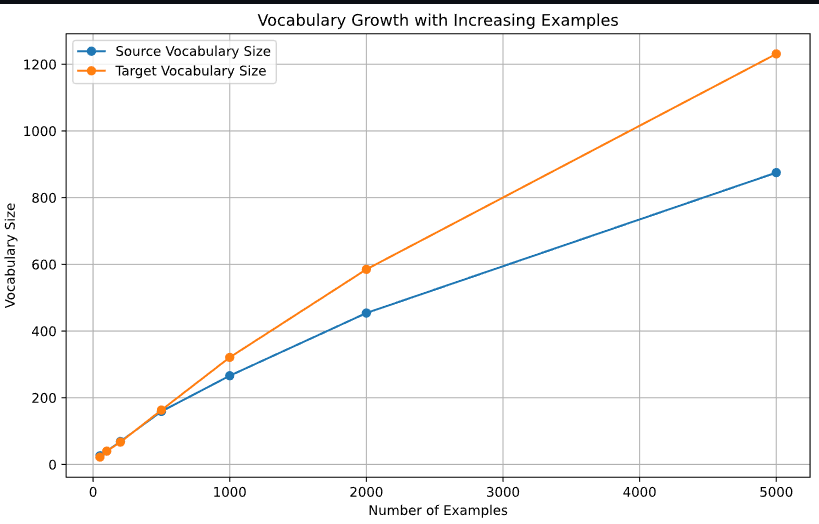

## Respostas

### 1. Tente valores diferentes do argumento num_examples na funçãoload_data_nmt. Como isso afeta os tamanhos do vocabulário do idioma de origem e do idioma de destino?

O gráfico demonstra o impacto do número de exemplos no tamanho dos vocabulários dos idiomas de origem e destino. À medida que mais exemplos são utilizados, o vocabulário de ambos os idiomas cresce proporcionalmente. Contudo, observa-se que o vocabulário do idioma de destino cresce de forma mais rápida e significativa, sugerindo maior complexidade linguística, como maior variação gramatical e lexical. 

Por exemplo, com 5000 exemplos, o vocabulário do idioma de destino chega a 1200 palavras, enquanto o de origem atinge 800. Essa diferença reflete a maior riqueza lexical do idioma de destino, o que pode afetar a performance do modelo em tarefas de tradução.

### 2. O texto em alguns idiomas, como chinês e japonês, não tem indicadores de limite de palavras (por exemplo, espaço). A tokenização em nível de palavra ainda é uma boa ideia para esses casos? Por que ou por que não?

#### Tokenização na Língua Chinesa
No chinês, os caracteres são morfemas que carregam significado e não são separados por espaços. Tentativas de tokenização baseada em espaços podem alterar o significado original das frases ou criar palavras inexistentes. Por exemplo, "中国" (Zhōngguó) significa "China", mas separar os caracteres resultaria na perda do sentido original. Se você separar "中" (meio) de "国" (país), o significado como "China" é perdido.

#### Tokenização na Língua Japonesa
*Fontes disponíveis no final da resposta.*

Ainda no mesmo contexto, a língua japonesa utiliza diferentes sistemas de escrita e símbolos especiais para delimitar frases, diferentes quando comparadas a estrutura de escrita ocidental. Uma abordagem eficiente é a **tokenização em sub-palavras**, que agrupa símbolos de acordo com seu significado, ou a **tokenização em nível de sub-caracteres**, que trata cada caractere como um token.

Em ambos os casos, a **frequência dos caracteres** e a **informação posicional** são essenciais para uma correta interpretação do texto. Além disso, ferramentas como **MeCab** e **SudachiPy** são usadas no japonês para prever fronteiras de palavras e lidar com variações linguísticas.

---

**Fontes**:
- [Sub-Character Tokenization for Chinese Pretrained Models](https://direct.mit.edu/tacl/article/doi/10.1162/tacl_a_00560/116047/Sub-Character-Tokenization-for-Chinese-Pretrained)  
- [Japanese Tokenization Methods](https://jamessullivan.github.io/blog/programming/japanese-tokenization/)